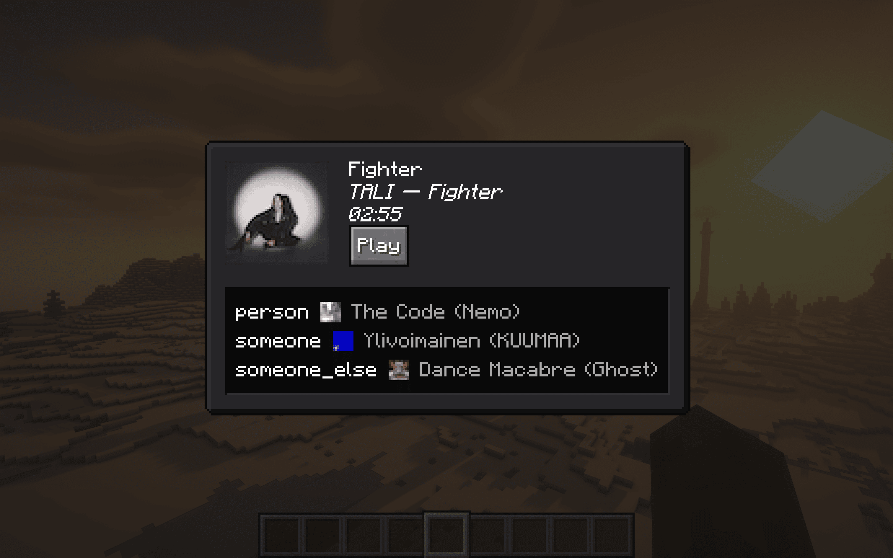
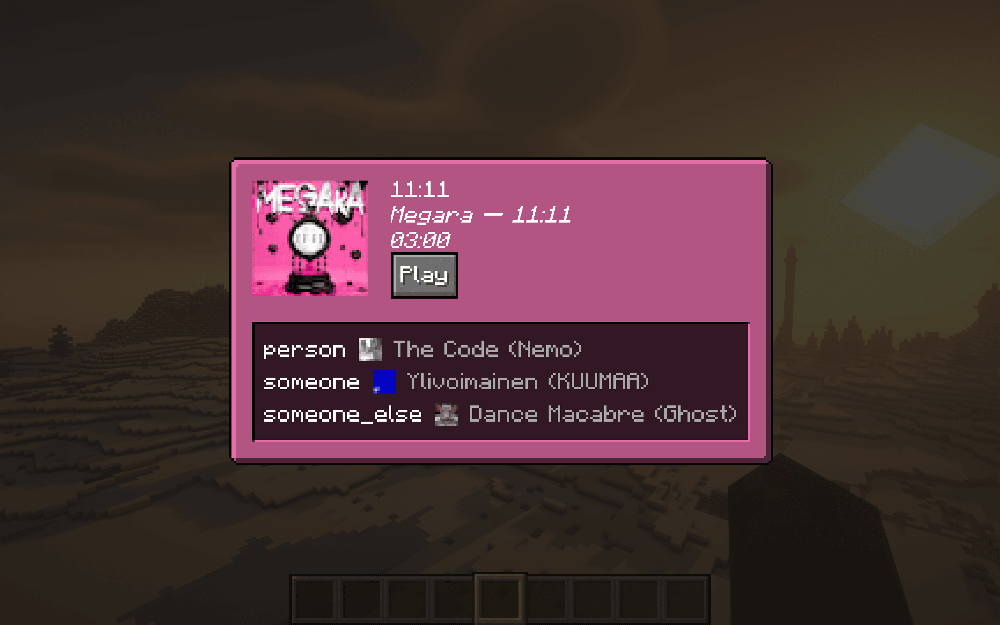

# Cranberry

In-game music playback on macOS

## Table of Contents

- [Cranberry](#cranberry)
  - [Table of Contents](#table-of-contents)
  - [Images](#images)
  - [Client Installation](#client-installation)
  - [Server Installation](#server-installation)
  - [Configuration Options](#configuration-options)
  - [How Does It Work?](#how-does-it-work)
  - [Windows / Linux?](#windows--linux)

## Images

## Client Installation

Cranberry is currently only supported on macOS and will automatically disable itself on any other platform.

If installed only on the client, pressing the keybind (M by default) will open a screen that shows what music is currently being played and allows you to play/pause it. By default, the background of the screen is dynamically tinted with the dominant color from the image - this can be disabled in the configuration (see [Configuration Options](#configuration-options)).

## Server Installation

Installing the mod on the server allows clients to see each other's music statuses - clients may disable sending or receiving statuses in the configuration. Note that if this mod is installed on the server, [owo-lib](https://modrinth.com/mod/owo-lib) (a library mod that this mod depends on) **_must_** be installed on every connecting client, or they will not be able to connect due to registry mismatches. The mod itself is optional.

## Configuration Options

You may edit configuration values in `config/cranberry-client-config.json5`. Alternatively, installing Mod Menu will allow you to change the following configuration options via a GUI:

- Send music statuses (default: true; only takes effect when playing multiplayer)
- Receive music statuses (default: true; only takes effect when playing multiplayer)
- Dynamic background (default: true)

## How Does It Work?

Magic.

  
Technical details

  Apple has a private framework on its platforms called `MediaRemote`, which allows for media playback information and control. Some Swift code is linked to this framework, built to a dynamic library, and called from Java using JNI.

## Windows / Linux?

While this sort of thing would generally be easier on Windows and Linux (Windows has `MediaPlayer` and Linux has MPRIS/D-Bus, both of which are well-documented and intended for public consumption, as opposed to Apple's `MediaRemote`), I have absolutely no experience working with WinRT or D-Bus. So although I'm interested in adding support, I don't currently actually have plans to do it.
